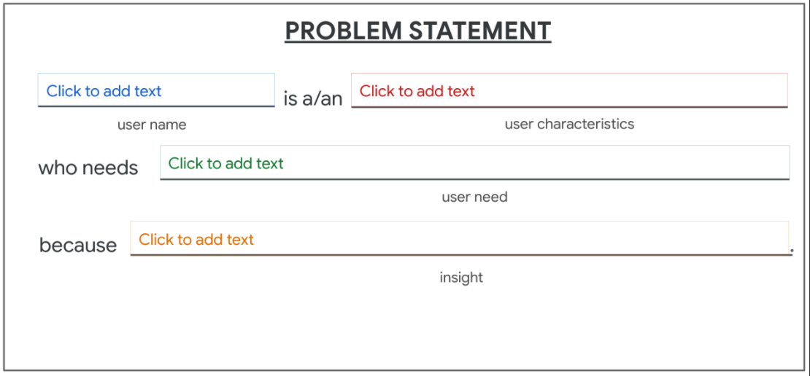

# WEEK 1

## Use Research to Inform Ideation

### Optional Reading: Learn more about how research informs ideation

Thinking of ideas for your product design isn’t a random or mysterious process! The designs you create will be supported by research, feedback from user interviews, and learnings from observations. All designers have assumptions about users and what they think is important or challenging for those users. Often, these assumptions are based on the designer’s own needs and experiences.  But, to come up with ideas for designs that meet users’ specific needs, your designs must be based on insights from actual user research, not assumptions. 

After you **empathize** with users and **define** the problems they’re facing, you’re ready for the third stage in the design process: **Ideate**. Your goal is to generate as many ideas as possible for potential solutions to the user problems you’ve identified. To do this, you should try multiple ideation techniques, and be prepared to have multiple ideation sessions. All of your ideas don’t have to be great; you won't end up using them all in the end! Instead, ideation requires you to push your creative boundaries and try to think of new perspectives to your design approach. So, no limits!

Earlier in the course, you used four tools - empathy maps, personas, user stories, and user journey maps - to help gain a deeper understanding of users’ needs. All of these tools informed the creation of a problem statement and will guide your ideation process moving forward. As a quick refresher: 

- **Empathy maps** explore users’ four main motivations: what the user says, thinks, does, and feels. The insights gathered from empathy maps help you come up with ideas for solutions that address the user’s real problems. 
- **Personas** place the users who you’re designing for front-and-center. By creating detailed user profiles, you can clearly envision potential users that you’d design for.
User stories determine which user needs are the most critical to address with your designs. This direction will help focus your ideation.
- **User journeys** help you come up with ideas for designs that truly support the users’ needs and solve their problems. 
- A **problem statement** is a clear description of the user’s need that should be addressed. The problem statement you created in the last course will guide the focus of your ideation. 

User research provides insights into how users behave, how users experience or think about a product, and more. Whether you conduct the user research yourself or with the help of a designated UX researcher, your research findings will help you understand how to design your product based on what your users really need. As UX designers, we always keep users top-of-mind, so using findings from research can go a long way in informing the ideation process.

Want to learn more about the link between research and ideation? Check out this article about [ideation for everyday design challenges](https://www.nngroup.com/articles/ux-ideation/) from Nielsen Norman Group.

---

### Reading: Revisit problem statements

As you prepare to create storyboards and wireframes in this course, you want to ensure that you have defined a problem statement for your mobile app. As a reminder, a problem statement is a clear description of the user’s need that should be addressed. A solid problem statement will inform your entire design process, so it’s important to get this right from the very beginning of your project.

A problem statement includes a fictional user’s name, characteristics, their needs, and a key insight gained from your research. You can use this template to create a problem statement:

*[User name] is a/an [user characteristic] who needs [user need] because [insight].*

With this template in mind, you might still be wondering: How do I create a problem statement for my own project? Let’s build a problem statement now, using this template and a real example. 

Consider this scenario: As the owner of a new construction business, Sawyer is looking for ways to network with other professionals in their industry. They think that networking may gain them more clients and help them learn from more experienced construction business owners. In order to network, Sawyer wants to research all of the trade conferences in their local area. 

With Sawyer and their needs in mind, we’ll use the template to create a problem statement. 

Sawyer is a construction business owner who needs to attend local trade conferences because they need to network to find more clients. 

And there you have it: A problem statement! This problem statement clearly lays out the information that we need to know about who the user is and how our design could help solve their problem. As you begin to come up with ideas and create wireframes for your app designs, continue to revisit the problem statements you’ve created, so that your designs will address important user needs.

---

Goal Statement 

goal statement, which is one or two sentences that describe the product and its benefits for the user. Goal statements cover who the product will serve, what the product will do, and why the product solves the user's need.

---

### Reading: Learn more about goal statements 

It’s time to merge the insights from empathy maps, personas, user stories, and user journey maps to come up with a focused scope for your designs. You’ll transition from the problem the user is facing to the solution we can create as UX designers. To focus the scope of your designs, you’ll create a goal statement. 

A goal statement is one or two sentences that describe a product and its benefits for the user. In other words, the goal statement provides the ideal solution for your design challenge. Goal statements cover who the product will serve, what the product will do, and why the product solves the user’s need. 

Let’s explore how you can create a goal statement for your own design project.

1. Revisit your problem statement. 

You need to understand the problem that users are facing before you can design a solution to address that problem. As a reminder, here is the template you can use to create a problem statement: 

*[User name] is a/an [user characteristics] who needs [user need] because [insight].*

Here’s an example of a problem statement from earlier in the certificate program that you might remember:

Sawyer is a construction business owner who needs to attend local trade conferences because they need to network to find more clients. 

If you didn't create a problem statement, you can still get the answers you need to create a goal statement. You can pull the who, what and why into your goal statement from various other parts of your research and work to date. You can find the who using the information from your persona. The user story can provide the what. And the empathy map and user journey maps will help you answer the why.

2. Transition from identifying the problem to defining the goal. 

At this point, it's time to transition from the problem that users are facing to the solution we can design to meet their needs. This can be a single, specific goal or a greater idea that you’ve chosen to be the focus of your design. 

Remember, the goal statement should be just one or two sentences that describes the product and its benefits for the user. Your goal statement needs to address the problem that you identified earlier in the problem statement. 

A strong goal statement:

- Describes a specific action users can take or what the product will do. 
- Defines who the action will affect. 
- States the positive impact of the action or why the product solves the user's need.
- Outlines success in measurable terms. 
To create a goal statement, you can fill in this template: 

Our [product] will let users [perform specific actions] which will affect [describe who the action will affect] by [describe how the action will positively affect them]. We will measure effectiveness by [describe how you will measure the impact].

Using this template, we can quickly write a goal statement that addresses the user problem identified in the problem statement above:

*Our TradeConference app will let users expand their business which will affect how business owners connect with new clients by giving them the ability to connect with clients at local trade shows. We will measure effectiveness by analyzing show attendance.* 

That's it! You now know how to create a great goal statement. With a little bit of practice, you’ll be able to write goal statements that confidently guide the product development process.

---

### Reading: Outline a user flow

Designing an efficient product requires a full understanding of users and their needs. There’s a lot that you can do with knowledge about the people you’re designing for. You can even predict user’s needs before they know what they want or need!

One example of predicting user needs is the process that happens when you order food from a restaurant. The cashier asks questions about condiments for your burger, whether you want a side of fries, and if you’d like a water or soda to drink. The cashier is anticipating your needs as a user and meeting those needs, possibly before you recognized those needs yourself. 

As a UX designer, you can anticipate user needs when interacting with your product. A clear and simple way to outline this process is by creating a user flow. A user flow is the path taken by a typical user on an app or a website, so they can complete a task from start to finish.

UX designers often outline the user flow before they start to design because it can help to picture how users will move through the app or website. In other words, before you design screens of an app, you need to understand how users can effectively move through the app overall. You need to determine:

- What actions will users take in the app?
- What decisions will users make?
- What screens will users experience after taking action or making a decision?

#### Draw a user flow

UX designers often outline user flows with common shapes: circles, rectangles, diamonds, and lines with arrows. Each shape represents an interaction the user will have with the product you're designing. Assigning a different shape to each interaction makes the user flow clear to anyone on the team involved in creating the product.

**Action:** The actions users take when moving through a product design are represented as circles. In other words, circles show steps that must be taken to complete a task from start to finish. For the user flow of a dog walker app, actions might include opening the app, clicking on a dog walker’s profile, and booking a dog walker. 

**Screen:** The screens of a digital product that users will experience while completing tasks are represented as rectangles. For the user flow of a dog walker app, screens might include a homepage or a booking confirmation page. 

**Decision:** Diamonds represent points in the user flow where users must ask a question and make a decision. The decision users make will either move them forward through the flow or back to an earlier part of the flow. For the user flow of a dog walker app, a decision could be choosing whether or not to book the dog walker whose profile is being reviewed. 

**User flow direction:** Lines with arrows tie everything together and display the flow of information. Solid lines indicate forward direction through the user flow, and the dotted lines indicate backward direction or returning to a previous page.

#### Example of a user flow 

To apply these concepts to a real product, check out an example user flow below, for the dog walker app that’s been mentioned throughout this certificate program. 

The user flow starts with a user’s entry into the app and continues all the way through to their appointment confirmation with a dog walker. This user flow anticipates the user’s need to browse multiple dog walker profiles before choosing the right walker. 

As a designer, you have to consider the entire journey that users take in order to get what they need from the product. As you create your own user flow, reference the problem statement you developed to ensure your designs will really address user needs. 

Keep in mind that the user flow could change based on the needs of users and their circumstances. If your problem statement changes, the user flow will probably need to change too. For example, imagine you learn that users of the dog walker app want tips on hiring dog walkers before booking an appointment. The user flow would change by allowing an option to break away from this planned user flow to visit a new screen within the app, as shown below. This screen might branch off of the "select dog walker" screen to provide extra information on booking a new walker. You don’t need to come up with a new user flow for every possible circumstance in the product, but you should ensure that the user flow you create focuses on the needs that the majority of users will face.

For your current project in this program, you’re designing an app from scratch and creating a completely new user flow. But in the real world, you might work on an existing product with an established user flow. For existing products, creating or updating the user flow can be complicated. With thorough user research, screens can be reorganized, expanded upon, and trimmed to better meet how users work through a product. Whether you’re working on a new or existing product, remember that users and their needs must be at the forefront of the product's design.

#### Tying it all together

One more thing: You might be wondering how user flows compare to the user journey maps or storyboards that you’ve already created. 

- A **user journey map** focuses on the end-to-end use case for one specific user type and one specific use case. 
- **Storyboards** are a visual representation of the way that a user interacts with one or multiple areas of your product. 
- **A user flow** describes what users see and how they interact with a product as they reach their goal. User flows illustrate all the different paths that users can take to reach their goal. 

Designing with knowledge of your user’s needs will make you a better designer and will keep users engaged in your product. Creating a user flow is a solid step. As a UX designer, one of your best tools is being able to outline the path that users will take to complete a task in your product. Now, it’s time to show what you know and create a user flow for your own app design. Good luck! 

---

#### The exemplar user flow provides:

- A clear and easy flow for users to get from the entry point of opening the app, to task completion of an order confirmation. 
- Clearly labeled steps that are each represented by the appropriate shape.
- Lines with arrows connecting all the steps of the user flow.

Compare this exemplar to the user flow diagram you created in the activity. What did you do well? Where can you improve? Take this feedback with you as you continue to progress through the course.

---

### Introduction to storyboarding user flows

In UX, a storyboard is a series of panels or frames that visually describe and explore a user's experience with a product.

Four elements of a storyboard 

- Character: The user in your story 
- Scene: Helps us imagine the user's environment 
- Plot: The benefit of solution of the design  
- Narrative: The user's need or problem and how the design will solve the problem 

---

