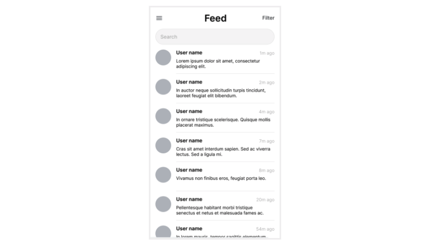
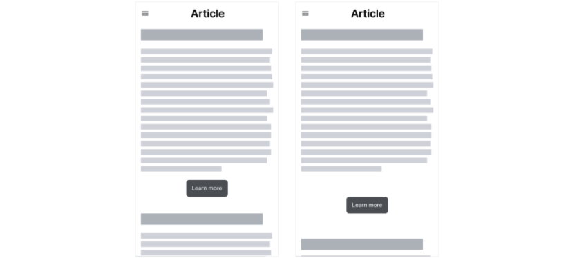
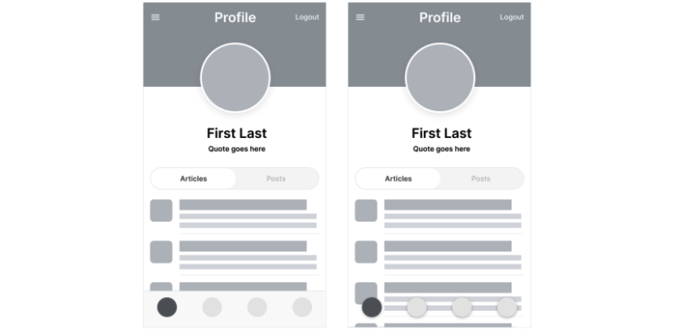

#WEEK 2

### The basics of information architecture (IA)

**Information architecture**, or IA, organizes content to help users understand where they are in a product and where the information they want is.

Importance of information architecture 
- Organizes and defines the overall structure for the app of site 
- Provides a hight-level view of a product 
- Helps stakeholders review your designs 
- Helps engineers understand how to organize the data 
- Allows your ideas to grow and iterate with the design 

---

### Create paper wireframes

##### Benefits of paper wireframes 
- Fast 
- Inexpensive 
- Explore lots of ideas 
- Narrow our focus 

##### When drawing wireframes:

It's important to list this information up front so, you remember to draw all of the elements in each of your wireframes. 

We're drawing wireframes for the homepage of our dog walking app. So, the information that needs to be included on this page might include a 
- navigation icon
- a search bar
- images
- text descriptions

---

### Reading: Activity Exemplar: Practice creating digital wireframes in Figma

To begin the process of creating digital wireframes, we pulled out our original paper wireframes and our research. We studied these materials to remind ourselves where we had decided to place our elements, and why.

Next, we opened Figma and started a new project file. Then, we uploaded pictures of the paper wireframes into Figma to use them as a reference. 

Once the paper wireframes were uploaded, we created frames for the device we were designing for. Once we had the correct number of frames for our design, we added a layout grid to keep everything lined up accurately. 

Then, it was time to design. We began to create each of the elements in our paper wireframes. We started with buttons and icons. We pulled basic icons from free asset libraries, and used shapes, lines, and fills to create the remaining elements. Once those were finished, we created content section and text placeholders. Note that we hadn't placed any of the elements onto our screens yet. 

After all of our elements were created, we began to place them into the design. We followed our paper wireframes as a model to make sure that we were aligning our digital wireframe with our previous design iterations and the insights we uncovered in our research. We repeated this process for each screen in our design until we had a full set of wireframes that were based on our paper wireframes. 

Notice that our example wireframe is easy to understand and conveys what is meant to happen on each screen to the user. It uses a hierarchy of information, bringing the most important information to the forefront. The importance of the information was based on the research we had completed earlier in the design cycle.  

Now compare the exemplar above to your completed deliverable. Assess what you’ve done using each of the criteria here to evaluate the exemplar. What do you do well? Where can you improve? Take this feedback with you as you continue to progress through the course. 

##### As a reminder, your digital wireframes should:

- Include built-out key screens of your product
- Be based on your paper wireframes
- Include more detail than the paper wireframes
- Consider the hierarchy of information on each screen
- Let the user know what they can do on any given screen

Don't forget to keep track of your digital wireframes so you can include images of them in your portfolio!

---

### Use Gestalt Principles when creating wireframes

Gestalt principles describe how humans group similar elements, recognize patterns, and simplify complex images when we perceive objects.

Gestalt principles got their name from the word Gestalt, which is a German word that means shape or form.

Here's the takeaway: When designing your wireframe, put elements that are related close together instead of far apart.

Commonly used gestalt principles 
- **Similarity** 
    - This principle means that elements that look similar are perceived to have the same function.
- **Proximity** 
    - This principle states that elements that are close together appear to be more related than things that are spaced farther apart.
- **Common region** 
    - This principle states that elements located within the same area are perceived to be grouped together.

 ---

 ### Reading: Learn more about using Gestalt Principles in wireframes

There is a belief among some people that, like a piece of art, the design of an app or website is subjective and open to a user’s personal interpretations, thoughts, or feelings. Although a user’s reaction to a design might be subjective, the design itself isn’t. Your designs will give users solid solutions to problems they experience. Think about what the user wants to do when they visit your app or website. What is their goal? How will you meet that need with your design? How will the user react? 

The human brain makes sense of the world around it by building logic, patterns, and structure. Gestalt Principles describe how humans group similar elements, recognize patterns, and simplify complex images when we perceive objects. These principles guide how humans view the designs around them in everyday life. In the wireframes you’re creating, you can apply Gestalt Principles to organize content so it is visually pleasing and easier to understand.

In the video, you learned about three of the Gestalt Principles: similarity, proximity, and common region. As a reminder: 

- **Similarity** means that elements that look alike (in shape, size, or color, for instance) are perceived to have the same function. 
- **Proximity** means that elements that are close together appear to be more related than things that are spaced farther apart.  
- **Common region** means that elements located within the same closed area are perceived to be grouped together.

So, how do you apply these Gestalt Principles to your own work? Check out an example of each of these three Gestalt Principles in actual wireframes. 

First, **similarity** is key when it comes to your wireframes. To help users navigate your app quickly, you want to keep “like with like” for consistency. For example, if you’re including avatars or images of users in the design of your app, you’ll want to make sure that the placeholders for those avatars are the same shape and size in your wireframes. This similarly indicates to users that the elements have the same function — in this case, linking to profiles of users.   

Next, imagine you draw a button labeled “learn more” close to the text of an article. If a user presses the button, they’ll assume they can learn more about the content of that article. This kind of design uses the Gestalt Principle of proximity to your advantage! Alternatively, if you leave a lot of space between the text of the article and the “learn more” button, users might not understand the connection between the two elements. A few seconds of confusion or hesitation can mean the difference between a user continuing to the next page of your app or closing it to find something more useful.

Finally, have you ever noticed that navigation bars at the top or bottom of a mobile phone screen are usually in a different color or grouped with a border? That’s the Gestalt Principle of common region in the real world. By creating a border and adding a block of color to a navigation bar, you can anchor the icons for the main pages of your app, instead of having the icons float on the screen. This design tip helps users recognize that the icons in the navigation bar are more important than others and are perceived to be grouped together.

There are countless ways to apply Gestalt Principles in your wireframes that improve the usability of your app. If you want to learn even more about Gestalt Principles, check out [this article from User Testing](https://www.usertesting.com/blog/gestalt-principles) that describes additional Gestalt Principles and this [article from UX Collective](https://uxdesign.cc/psychology-design-4-gestalt-principles-to-use-as-your-next-design-solution-fcdec423a6bf) with examples of the Gestalt Principles in wireframes. 

---

