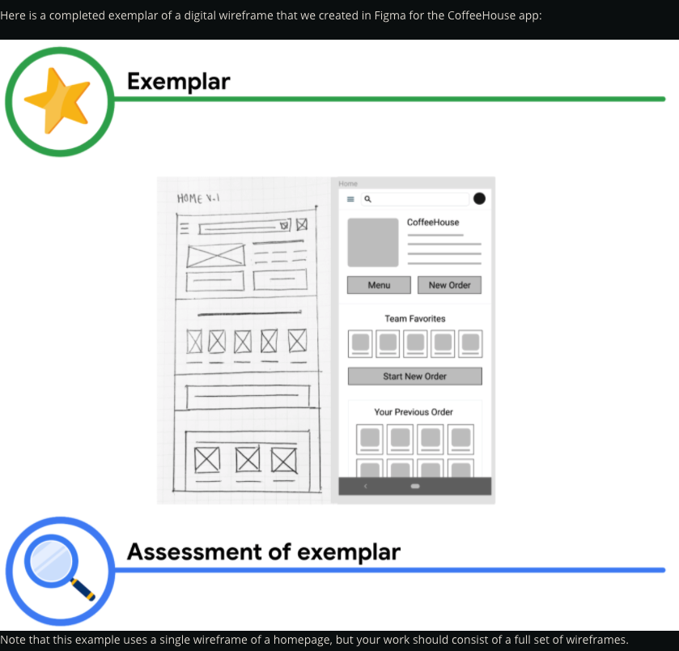

#WEEK 2

### The basics of information architecture (IA)

**Information architecture**, or IA, organizes content to help users understand where they are in a product and where the information they want is.

Importance of information architecture 
- Organizes and defines the overall structure for the app of site 
- Provides a hight-level view of a product 
- Helps stakeholders review your designs 
- Helps engineers understand how to organize the data 
- Allows your ideas to grow and iterate with the design 

---

### Create paper wireframes

##### Benefits of paper wireframes 
- Fast 
- Inexpensive 
- Explore lots of ideas 
- Narrow our focus 

##### When drawing wireframes:

It's important to list this information up front so, you remember to draw all of the elements in each of your wireframes. 

We're drawing wireframes for the homepage of our dog walking app. So, the information that needs to be included on this page might include a 
- navigation icon
- a search bar
- images
- text descriptions

---

### Reading: Activity Exemplar: Practice creating digital wireframes in Figma

To begin the process of creating digital wireframes, we pulled out our original paper wireframes and our research. We studied these materials to remind ourselves where we had decided to place our elements, and why.

Next, we opened Figma and started a new project file. Then, we uploaded pictures of the paper wireframes into Figma to use them as a reference. 

Once the paper wireframes were uploaded, we created frames for the device we were designing for. Once we had the correct number of frames for our design, we added a layout grid to keep everything lined up accurately. 

Then, it was time to design. We began to create each of the elements in our paper wireframes. We started with buttons and icons. We pulled basic icons from free asset libraries, and used shapes, lines, and fills to create the remaining elements. Once those were finished, we created content section and text placeholders. Note that we hadn't placed any of the elements onto our screens yet. 

After all of our elements were created, we began to place them into the design. We followed our paper wireframes as a model to make sure that we were aligning our digital wireframe with our previous design iterations and the insights we uncovered in our research. We repeated this process for each screen in our design until we had a full set of wireframes that were based on our paper wireframes. 

Notice that our example wireframe is easy to understand and conveys what is meant to happen on each screen to the user. It uses a hierarchy of information, bringing the most important information to the forefront. The importance of the information was based on the research we had completed earlier in the design cycle.  

Now compare the exemplar above to your completed deliverable. Assess what you’ve done using each of the criteria here to evaluate the exemplar. What do you do well? Where can you improve? Take this feedback with you as you continue to progress through the course. 

##### As a reminder, your digital wireframes should:

- Include built-out key screens of your product
- Be based on your paper wireframes
- Include more detail than the paper wireframes
- Consider the hierarchy of information on each screen
- Let the user know what they can do on any given screen

Don't forget to keep track of your digital wireframes so you can include images of them in your portfolio!

